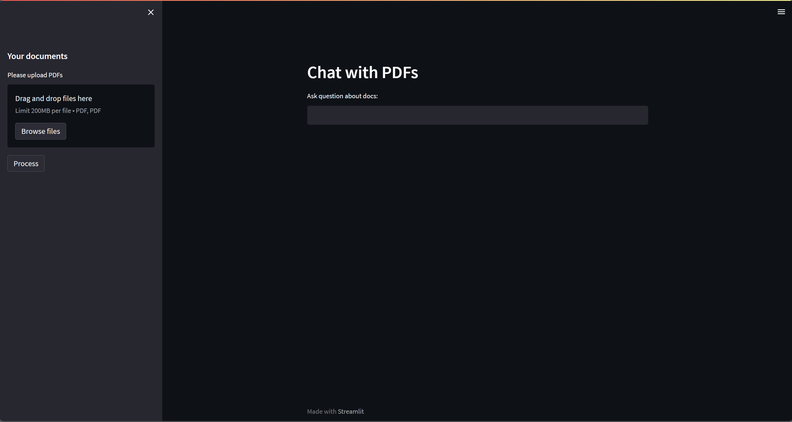
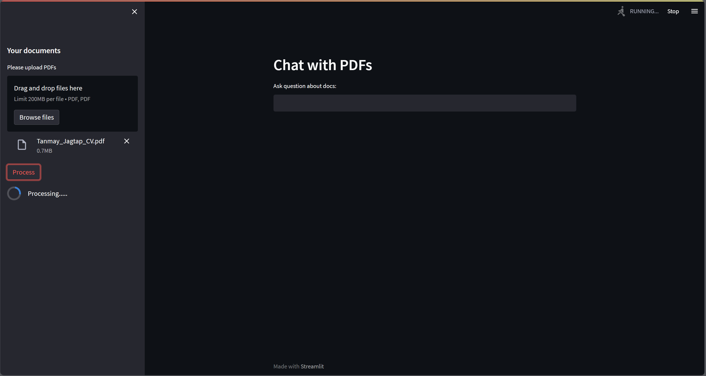
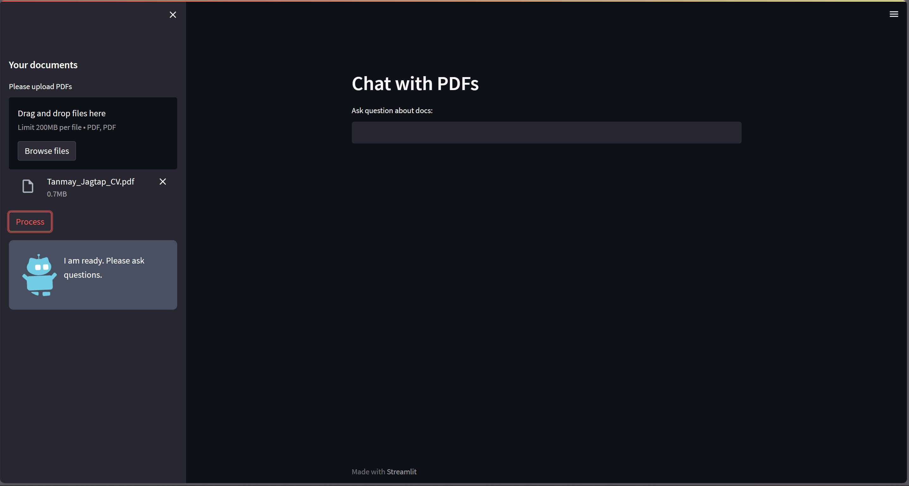
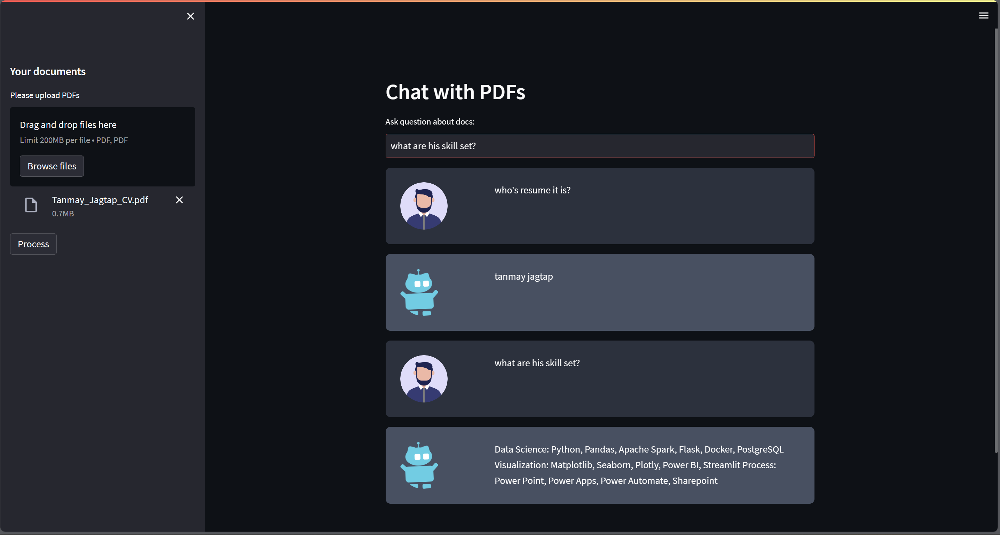

# LLM4PDF
The Chat with PDF App is a Python-based tool designed to simplify your interaction with PDF documents using everyday language. Whether you're studying, researching, or just curious, you can now ask questions about your PDFs as if you were chatting with a friend. The app uses advanced language processing to understand your queries and provide relevant answers directly from the content of your documents.

We've made the interface user-friendly with Streamlit, so you can navigate your PDFs effortlessly. Currently, the app runs smoothly on your local machine, but it's also ready to be deployed using other models like GPT-3 or GPT-4 for wider accessibility.

Experience the convenience of exploring your PDFs in a whole new way with the Chat with PDF!

### Initial view

### Upload PDF 
In this case I am uploading my resume. 

### Processing text
Model will learn text present in PDF and create its vectormap.

### Model is ready

### Ask Questions
Now you can ask questions to model in context of provided document.
